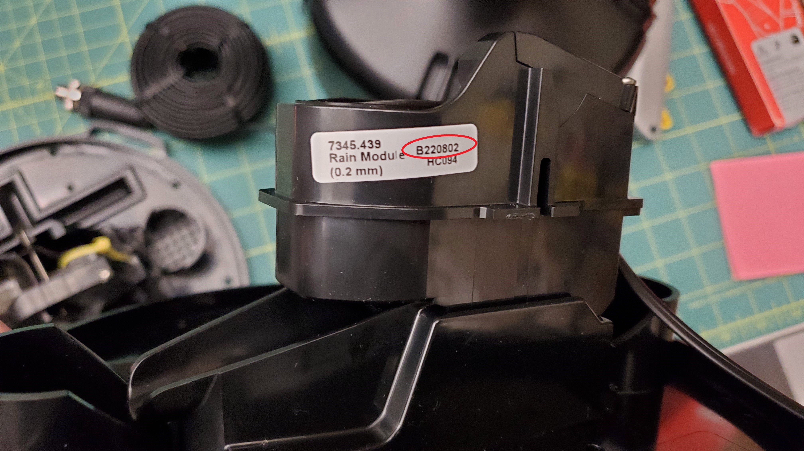
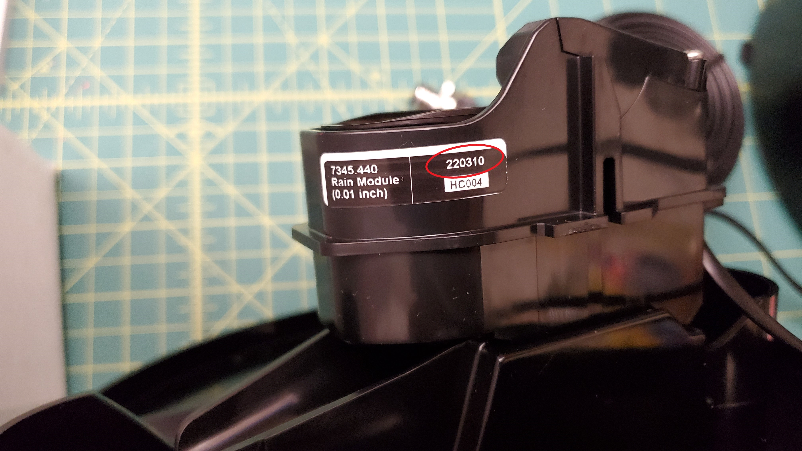

# Type: Rain Gauge
# Make: Davis
# Model(s): 6464M/6466M

## Assembly Process
- Procure parts detailed in [BoM](BoM_RainGauge_Davis.csv)
- Attach connector according to specifications provided in [cable assembly](CableAssembly_-_RainGauge_Davis.pdf) guide

### Pinout Alternatives
The Davis rain gauge has recently (Q2 2022) changed the pinouts used in their gauges which is not as of yet reflected in their documentation. This variation in pinout is noted in the assembly guide as _Legacy_ and _Updated_. 

The _Updated_ version can be identified by the prefix of the letter 'B' to the date code located on the tipping element itself. See referance images below for example. 

#### Updated Sensor

#### Legacy Sensor
